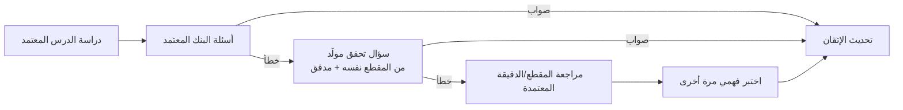
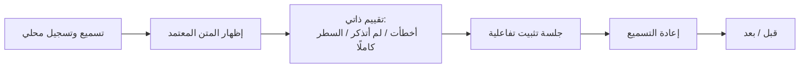
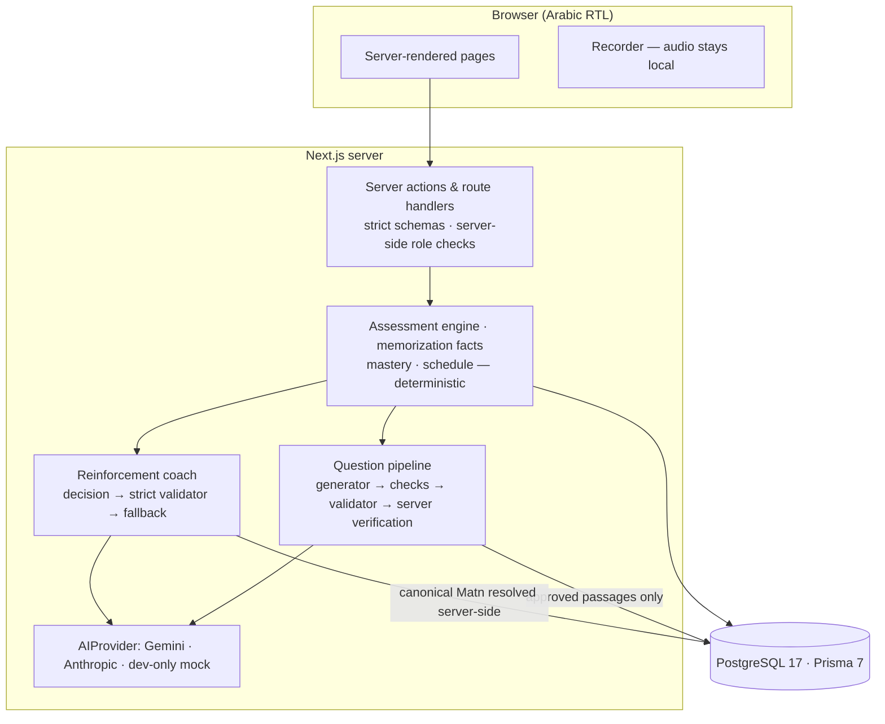

<div dir="rtl">

# تفقّه | Tafaqqah

منصة تعليمية عربية لدراسة الفقه الحنبلي من مصادر معتمدة بشريًا: تفهم الدرس، وتُختبر في فهمه اختبارًا يتكيّف مع أخطائك، وتحفظ المتن وتثبّته بمساعدة مدرّب تكيفي. الذكاء الاصطناعي فيها مقيّد بالمصدر المعتمد، ولا يقرّر حكمًا فقهيًا.

> [!IMPORTANT]
> تفقّه أداة تعليمية، ولا يقدّم فتاوى. الذكاء الاصطناعي فيه لا يقرّر حكمًا فقهيًا، ولا يختار المصادر، ولا يعتمد محتوى، ولا يغيّر نص المتن.

## جرّب تفقّه مباشرة | Live Application

**الرابط:** [ADD AFTER DEPLOYMENT]

### تجربة الطالب

لا يوجد حساب طالب تجريبي جاهز؛ استخدم التسجيل العادي. كل ما تفعله يُحفظ فعلًا في قاعدة PostgreSQL للبيئة المنشورة.

1. افتح المنصة
2. أنشئ حسابًا جديدًا
3. سجّل الدخول
4. افتح الدرس الأول (المنهج ← «أخصر المختصرات» ← الدرس الأول)
5. أكمل التقييم
6. جرّب المراجعة الموجهة (تظهر عند تكرار الخطأ في مفهوم)
7. جرّب رحلة الحفظ
8. سجّل الخروج وادخل مرة أخرى لمشاهدة استمرار تقدمك

### لوحة الإدارة — للجنة التحكيم

| | |
|---|---|
| لوحة الإدارة | [ADD AFTER DEPLOYMENT] |
| البريد | [ADD FINAL JUDGE ADMIN EMAIL] |
| كلمة المرور | [ADD FINAL JUDGING PASSWORD] |

بيانات الدخول أعلاه مخصصة للتحكيم وتمنح الوصول إلى لوحة إدارة تفقّه الفعلية في البيئة المنشورة.

هذا حساب إدارة داخل التطبيق فقط (دور `ADMIN`)، أُنشئ لأغراض التحكيم بكلمة مرور خاصة به. لا يتيح الوصول إلى الاستضافة أو قاعدة البيانات مباشرة أو GitHub أو مزوّد الذكاء الاصطناعي أو أي مفتاح أو متغير بيئة. لا تُعرض مفاتيح الخدمات في أي صفحة، ولا يمكن منح صلاحية المدير من المتصفح.

ما يمكن تجربته فعليًا في اللوحة:

| الصفحة | ما فيها |
|---|---|
| `/admin` | نظرة عامة على المحتوى وحالة الاعتماد والنشر |
| `/admin/curriculum` · `/admin/lessons` | المستويات والكتب والأبواب والدروس، وتفاصيل كل درس ومفاهيمه وأسئلته الثابتة |
| `/admin/sources` | المقاطع المصدرية مع بيانات المصدر: الموضع والطبعة ورابط التفريغ الزمني وصفحات PDF |
| `/admin/review` | مراجعة المحتوى واعتماده: النص والتوقيت والمفاهيم والأسئلة الثابتة |
| `/admin/matn` | مراجعة أقسام المتن ومقاطعه ووحدات الحفظ واعتمادها |
| `/admin/ai` · `/admin/logs` | تتبّع الذكاء الاصطناعي: كل سؤال مرشّح، مقبول أو مرفوض، مع السبب ونسخة المقطع والموجّه والنموذج، وتجربة توليد سؤال |
| `/admin/analytics` · `/admin/evaluation` | تحليلات التعلم، ومقارنة الاختبار الثابت بالتكيفي (مع تصدير) |
| `/admin/students` | حسابات المتعلمين وتقدمهم |
| `/admin/audit` | سجل كل عملية إدارية |
| `/admin/settings` | حالة الذكاء الاصطناعي (المزوّد والنموذج فقط، دون أي مفتاح) وقواعد الاعتماد |

الحالة الأولية للبيئة المنشورة: الدرس الأول **منشور**، والدرس الثاني **غير منشور** (مسودة تحت المراجعة العلمية، وليس ضمن بيانات النشر).

## ما المشكلة التي يحلها تفقّه؟

يدرس كثير من طلاب العلم المتون والشروح دون أن يعرفوا بدقة ما فهموه فعلًا وما يحتاج إلى مراجعة، ودون وسيلة منظمة لتثبيت محفوظهم في المواضع التي ينسونها أو يخطئون فيها. والأدوات العامة المعتمدة على الذكاء الاصطناعي قد تولّد معلومات فقهية غير موثّقة.

## كيف يعمل؟

رحلتان مرتبطتان بالمصدر نفسه:

- **تعلّم وافهم:** دروس من مصدر معتمد، ثم اختبار فهم يبدأ ببنك أسئلة راجعه إنسان، ويتعمّق في المفاهيم التي أخطأ فيها المتعلم بأسئلة تحقق مولّدة من المقطع نفسه، ثم مراجعة موجّهة للمقطع المعتمد وتوقيته في الشرح المرئي.
- **احفظ وثبّت:** تسميع المتن بتسجيل يبقى على جهازك، ثم مقارنة بالنص المعتمد وتقييم ذاتي على مستوى الكلمة، ثم جلسة تثبيت تفاعلية تتكيف مع استذكارك، ثم إعادة التسميع وقياس ما ثبت.





## معمارية الذكاء الاصطناعي

**رحلة الفهم:**

```
Approved Source → AI Generator → Deterministic Checks → Independent Validator → Server Verification → Display / Reject
```

- أسئلة التقييم الأساسية (16 سؤالًا للدرس الأول) **ليست** مولّدة: كتبها إنسان واعتمدها.
- عند الخطأ يولّد النموذج سؤال تحقق من المقطع المعتمد نفسه فقط، ثم فحوص حتمية، ثم مدقق مستقل، ثم تحقق الخادم من أن الدليل موجود حرفيًا في المقطع. ما لا يمكن إثباته من المقطع يُرفض ولا يُعرض، ويُسجَّل مع سببه.

**رحلة الحفظ:**

```
Structured Learner Performance → bounded adaptive reinforcement → learner response → next bounded exercise
```

- بعد أن يحدد المتعلم بنفسه المواضع التي أخطأ فيها أو نسيها، يختار النموذج التمرين التالي من أدوات محددة سلفًا (كلمة ناقصة، استذكار بالسياق، تقليل التلميح، الانتقال بين سطرين، عودة مؤجلة، السطر كاملًا، أسطر متتالية). يُخرج قرارات منظّمة فقط (نوع التمرين وأرقام المواضع)، والنص يُستخرج دائمًا من المتن المعتمد في الخادم. كل قرار يمر بمدقق صارم، ويوجد بديل حتمي عند الإخفاق.

**أين لا يُستخدم الذكاء الاصطناعي:** لا يصدر فتاوى، ولا يحدد حكمًا فقهيًا، ولا يختار المصادر، ولا يعتمد محتوى، ولا يكتب نصًّا معتمدًا أو توقيتًا، ولا يحكم على التلاوة أو يسمع الصوت، ولا يقرر الإتقان المخزّن ولا التصحيح ولا جدول المراجعة النهائي. هذه كلها قرارات بشرية أو حتمية في الكود.

التفاصيل: [docs/AI_ARCHITECTURE.md](docs/AI_ARCHITECTURE.md).

## الموثوقية والسلامة العلمية

- **اعتماد بشري:** لا يرى المتعلم ولا النموذج إلا ما اعتمده إنسان في لوحة الإدارة. تعديل النص بعد اعتماده يلغي الاعتماد.
- **فصل المولّد عن المدقق:** كل سؤال مولَّد يمر بفحوص حتمية ومدقق مستقل، ويُحفظ كل مرشّح (المقبول والمرفوض) مع سبب القرار.
- **تصحيح حتمي:** الإجابات تُصحَّح بمفتاح محفوظ في الخادم، والإتقان والجدولة تحسبها قواعد ثابتة في الكود.
- **الإخفاق الآمن:** إذا تعذّر النموذج أو رُفض ناتجه لا يُعرض محتوى مزيّف: يستمر الاختبار ببنك الأسئلة المعتمد، ويستمر التثبيت بتمارين حتمية.
- **حماية الخادم:** صلاحيات الإدارة تُفحص في الخادم في كل صفحة وإجراء وواجهة برمجية؛ صفحات الإدارة تُرجع 404 لغير المدير، والخدمات الإدارية تُرجع 403.

## الخصوصية

- تسجيل التسميع يبقى في المتصفح: لا يُرفع إلى الخادم، ولا يُحفظ في قاعدة البيانات، ولا يُحوَّل إلى نص، ولا يُرسل إلى أي نموذج.
- لا يتلقى الذكاء الاصطناعي اسم المتعلم أو بريده أو معرّفاته؛ يتلقى حقائق منظمة بمراجع مجهولة فقط.
- مفاتيح النماذج والموجّهات لا تُرسل إلى المتصفح.
- لاحظ أن حساب الإدارة يرى حسابات المتعلمين (الاسم والبريد) وتقدمهم في البيئة المنشورة، كما في أي لوحة إدارة.

## النطاق العامل حاليًا

| الرحلة | المحتوى |
|---|---|
| الفهم | مقرر واحد مفعّل. **الدرس الأول منشور:** 12 مقطعًا مصدريًا معتمدًا، و12 توقيتًا معتمدًا، و16 سؤالًا أساسيًا ثابتًا معتمدًا |
| تمهيد | درسان تعريفيان قصيران عن منهج تفقّه نفسه («منهج الدراسة والاختبار» و«الإتقان والتكيّف والمراجعة»)، نصهما مكتوب للمشروع وموسوم بأنه تجريبي، وليس محتوى فقهيًا |
| الحفظ | 8 أقسام معتمدة، و19 مقطعًا، و94 وحدة حفظ معتمدة (من مقدمة المؤلف إلى نهاية فصل الحيض والنفاس) |
| الدرس الثاني | مسودة تحت المراجعة العلمية، غير ظاهرة للمتعلم، وليست ضمن بيانات النشر |
| المستويات 2–7 | خارطة طريق فقط («قريبًا»)، دون محتوى |

</div>

## Technical architecture



All state (accounts, sessions, progress, mastery, memorization history, AI logs) lives in PostgreSQL. Approved release content ships as `prisma/seed-data/release-content.json` and is loaded into an empty database on first start. It contains no users, sessions or learner data.

**Tech stack:** Next.js 16.3.8 (App Router) · React 19.2.8 · TypeScript · Node 22 · Tailwind CSS 4 · PostgreSQL 17 · Prisma 7.10.0 (`@prisma/adapter-pg`) · Zod · Google Gen AI SDK (Gemini) · Anthropic SDK · Vitest · Playwright · Docker Compose.

More: [docs/AI_ARCHITECTURE.md](docs/AI_ARCHITECTURE.md) · [docs/DEPLOYMENT.md](docs/DEPLOYMENT.md) · [docs/ATTRIBUTION.md](docs/ATTRIBUTION.md).

## Quick start with Docker

Requirements: Docker with Docker Compose.

```bash
git clone <repo-url> Tafaqqah
cd Tafaqqah
cp .env.example .env          # Windows: copy .env.example .env
# edit .env: POSTGRES_PASSWORD (required); GEMINI_API_KEY for real AI; ADMIN_EMAIL/ADMIN_PASSWORD for an admin account
docker compose up --build
```

Open <http://localhost:3000> (or `APP_PORT`).

1. PostgreSQL starts with a persistent volume (`tafaqqah-pg`).
2. All migrations are applied. **On an empty database only**, the learning path and the human-approved release content are loaded, and the admin account from `ADMIN_EMAIL`/`ADMIN_PASSWORD` is created. Restarts never re-seed or overwrite admin edits.
3. The app starts. `/api/health` reports database and AI status.

**Without an AI key** the app still works: the understanding test uses the approved question bank only, AI follow-up questions are skipped (never faked), and memorization reinforcement uses deterministic fallback exercises. `/api/health` reports `degraded`.

Useful: `docker compose logs -f app` · `docker compose down` (keeps data) · `docker compose down -v` (deletes the database).

## Local development (without Docker)

```bash
npm install                     # runs prisma generate
cp .env.example .env            # set DATABASE_URL
npx prisma migrate deploy
npm run db:seed
npm run dev
```

## Environment variables

See [.env.example](.env.example) (placeholders only, never real values).

| Group | Variables |
|---|---|
| **Required** | `POSTGRES_PASSWORD` (Docker) **or** `DATABASE_URL` (non-Docker) |
| **Recommended for real AI** | `AI_PROVIDER` (`gemini` or `anthropic`) + `GEMINI_API_KEY` or `ANTHROPIC_API_KEY` |
| Optional | `APP_PORT`, `POSTGRES_USER`, `POSTGRES_DB`, `ADMIN_EMAIL`, `ADMIN_PASSWORD`, `GEMINI_MODEL`, `AI_GENERATOR_MODEL`, `AI_VALIDATOR_MODEL`, `AI_GENERATOR_EFFORT`, `AI_VALIDATOR_EFFORT`, `ASSESSMENT_MODE_STRATEGY`, `AI_RATE_LIMIT_PER_10_MIN`, `REINFORCEMENT_BASELINE_USER_IDS` |
| Tests only | `TEST_DATABASE_URL` (a separate database; tests empty it) |

AI keys are read only from server-side environment variables; they are never sent to the browser or stored in the database or seed files.

## Tests & verification

```bash
npm run typecheck && npm run lint
npm test                        # needs TEST_DATABASE_URL (a separate database that the tests empty)
npm run build
```

Release audit (2026-10-05):

| Check | Result |
|---|---|
| Automated tests (Vitest) | 528 passed, 0 failed, 30 public test files. Internal Lesson 2 review artifacts and their draft test pipeline are intentionally excluded from the public repository. |
| Typecheck | passes |
| ESLint | 0 errors (5 warnings in untouched files) |
| Production build | passes |
| Prisma validate / Client generation | pass |
| Fresh PostgreSQL | all 19 migrations apply on an empty database |
| Docker | clean-clone startup, first-boot seed, persistence across restart, registration, Lesson 1 and the memorization scope verified |
| Mobile | 390 px width checked for horizontal overflow |
| Real AI | **0 real Gemini calls were made during the release audit.** All automated tests use a mock provider. Live Gemini behaviour is still to be verified on the deployed environment |

Playwright end-to-end tests live in `e2e/` and need a running server.

## Sources & attribution

- **Matn:** «أخصر المختصرات» — محمد بن بدر الدين بن بلبان الحنبلي. Transcribed word for word (Matn only, no footnotes or editorial material) from the edition by د. أنس بن عادل اليتامى و د. عبدالعزيز بن عدنان العيدان، دار ركائز للنشر والتوزيع، الطبعة الأولى 1441هـ / 2019م. Data: [content/sources](content/sources/akhsar-al-mukhtasarat-matn.md).
- **Explanation (Lesson 1):** شرح الشيخ محمد بن أحمد باجابر. Its video is referenced by URL with human-approved timestamps and is never re-hosted.
- Every passage stores its own provenance (visible in `/admin/sources`). The in-app methodology page is `/methodology`.
- **Attribution does not imply permission.** This project claims no publisher permission, redistribution licence, endorsement, partnership or scholarly certification. Source PDFs/scans are not included in this repository. Details: [docs/ATTRIBUTION.md](docs/ATTRIBUTION.md).

## Current limitations

- **Content:** one published lesson in the understanding journey, and a portion of the Matn (approved units only) in the memorization journey. Lesson 2 is an unpublished draft. Levels 2–7 are roadmap only.
- **Human approval:** new content stays hidden until a person approves it in the admin console.
- **AI:** output quality is constrained by the source but not guaranteed. The system rejects what it cannot prove and does not claim the model never errs. Live Gemini behaviour has not yet been verified on a deployment. Free-tier provider quotas are small.
- **No impact claims:** pre/post measurement and the fixed-vs-adaptive comparison exist, but no results have been collected.
- **Admin access is full application access:** the judging admin account can change and approve content like any admin. Every change is recorded in `/admin/audit`.

## Project structure

```
src/app/            routes: (shell) learner pages · (focus) assessment · (auth) login/register · (admin) admin console · api/
src/server/         assessment engine, AI pipeline & providers, memorization, auth, admin services
src/components/     UI components
src/lib/            client utilities (incl. the local-only recorder)
prisma/             schema, 19 migrations, seed.ts, seed-data/ (learning path + approved release content)
content/            canonical Matn source text and its structure
scripts/            content import/export, admin bootstrap, Docker bootstrap, verification helpers
tests/              Vitest unit & integration tests
e2e/                Playwright end-to-end tests
docs/               AI architecture, deployment, attribution
```

## License

The MIT license applies to the software code authored for this project. Third-party source materials remain subject to their respective rights and are not relicensed by this repository. See [LICENSE](LICENSE) and [docs/ATTRIBUTION.md](docs/ATTRIBUTION.md).

**Author:** Hala Alharbi | هلا الحربي
