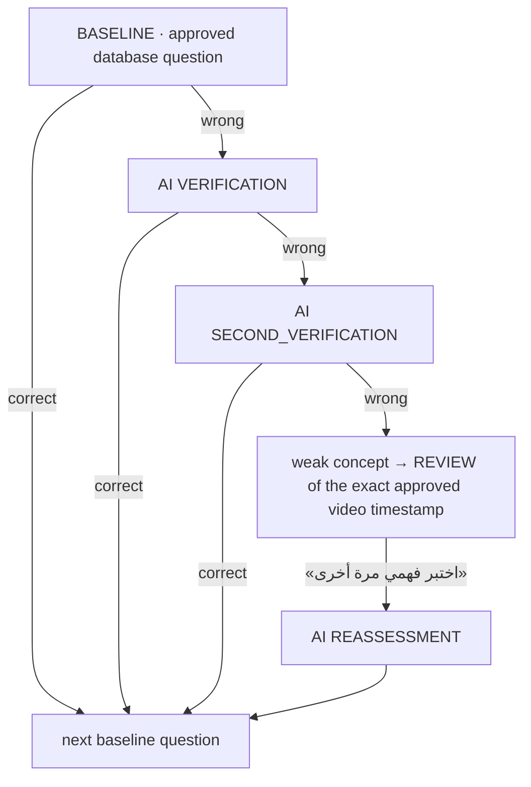
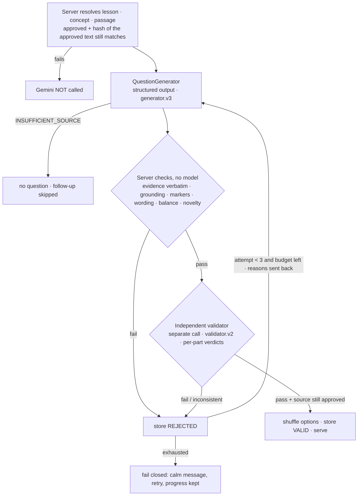

# AI architecture

> This document covers the understanding journey. The memorization journey also uses the model, as a bounded reinforcement coach: it only picks the next exercise type and positions from a fixed set, after the learner's own self-assessment, and every decision passes a strict validator with a deterministic fallback (see the README).

In the understanding journey, Tafaqqah uses a language model for **one job only**: writing and checking assessment questions about **one approved source passage at a time**. The model never teaches, never decides or weighs a ruling, never answers open fiqh questions, never grades answers, and never produces video timestamps.

**Gemini writes the question. Gemini is not the source of the fiqh.** The only source of truth is the human-approved `SourcePassage` of the current concept. If a claim cannot be proven from it, it must not reach a learner — even if it is true, even if it is famous.

We do **not** claim the model cannot hallucinate. What is built is: strict source grounding + server-verified evidence + an independent validator + rejection + human-approved sources + fail-closed behaviour.

## What is AI and what is not

| Stage | Source of the question | Model call |
|---|---|---|
| `BASELINE` | Human-approved question bank in the database (`FixedQuestion`) | **none** |
| `VERIFICATION` | Generated at runtime after a wrong baseline answer | generator + validator |
| `SECOND_VERIFICATION` | Generated at runtime after a wrong verification | generator + validator |
| `REASSESSMENT` | Generated at runtime after the learner reviewed the exact approved video segment | generator + validator |

A fixed question is never used as a stand-in for a generated one, and pre/post measurement tests never call the model.

One mistake is never a weak concept: it takes three wrong answers in a row (baseline + two differently-angled checks). Mastery scoring and thresholds are unchanged (`src/server/assessment/config.ts`, `mastery.ts`). The assessment never completes while a follow-up is pending, even if the last baseline question was the wrong one. The chain logic is pure and unit-tested (`src/server/assessment/followup.ts`).

## Generation pipeline

### 1. Server-side source retrieval (`src/server/ai/source.ts`)

The browser sends only ids and an option index (strict schemas reject anything else, including `sourceText`, `passageId`, `conceptId`, `stage`). Before any model call the server checks that the concept belongs to the session's lesson; the passage belongs to that concept and lesson; it is approved; its text is not empty; and **its text is still the text that was approved**.

The last check uses `SourcePassage.approvedTextHash`, stamped by a PostgreSQL trigger the moment a passage becomes approved (and cleared on revocation), so it covers admin approval, bulk approval, scripts and seeds alike. A row edited after approval — even by a path that bypassed the admin service — fails the hash comparison and the model is not called. The check is repeated right before a generated question is stored.

### 2. Generator (`question-generator.ts`, `prompts.ts`)

System prompt: the model is a question writer, not a source; APPROVED_SOURCE is the only permitted source; no prior knowledge, search, tools, other lessons/concepts/madhhabs; no ruling, condition, exception, reason, disagreement, opinion, tarjih, definition, evidence, hadith, verse, scholar, number or detail unless the source states it; never complete, correct, broaden or infer; no invented scenarios (accuracy → clarity → variety); `INSUFFICIENT_SOURCE` is always better than an unsupported question. Passage, learner context and task blocks are data; embedded tags are neutralised.

Context sent: stage, concept title, the approved passage, the question just missed, the learner's answer, the correct answer, every question already shown/banked for the concept and the answers they tested. These only steer *how to test understanding* (a different statement of the source, or the opposite direction of the same one) — they are never a source of facts.

Structured output: `{status, questionType: "MCQ", question, options: [{id: A–D, text}], correctOptionId, explanation, grounding: {answerEvidence, explanationEvidence}}`. `grounding` is internal and never shown. Every response is re-parsed with strict Zod schemas; unknown fields make the output malformed.

### 3. Server checks (`checks.ts`) — run before the validator model

- **Evidence verified by the server:** `answerEvidence` and `explanationEvidence` must exist verbatim in the passage (Arabic normalisation only: diacritics, whitespace, hamza/ya/ta-marbuta forms), be long enough to mean something and short enough to be evidence. Stitched-together pieces fail.
- **Grounding** of the correct answer, the question and the explanation in the passage.
- **Knowledge markers** absent from the passage: other madhhabs/«الجمهور», disagreement/tarjih, Qur'an/hadith/narrators/consensus vocabulary and verse brackets, conditions, exceptions, reasons (ta'lil), scholar names, numbers and quantities (in the question, correct answer and explanation).
- **Internal wording block**, in question, options and explanation: «بحسب/وفق/بناءً على/استنادًا إلى/كما ورد في النص/المصدر/الدرس/المقطع/السياق», «ذكر النص», «كما ورد», «النص المعتمد», «المصدر المعتمد», «السياق المسترجع», Latin words such as source/context/RAG/validator/Gemini.
- **Distractor quality:** four options A–D, no duplicates, no «جميع ما سبق/لا شيء مما سبق», no labels in the text, balanced lengths, the correct option not recognisable by being longer.
- **Language:** Arabic only; length limits; explanation never empty.
- **Novelty:** not a near-copy (content-word overlap ≥ 0.7) of the baseline or of any earlier question on the concept.

### 3b. Meaning fidelity (no semantic drift)

A paraphrase may not change the degree or logic of the source. Measured with the real model (`scripts/real-gemini-overreach.ts`): `gemini-3.5-flash-lite` as a reviewer **catches only about half** of crafted overreaches on its own, so the guarantee does not rest on it. The server enforces: degree / negation / ruling words in the correct answer and the explanation must occur in the excerpt cited for them (`«لا كلام لنا فيه ولا في علاجه»` → `«ليس له علاج»` is rejected); a negation must keep the same following word as in the excerpt; a hedge the excerpt contains («أحيانًا»، «غالب»، «بعض»…) may not be dropped while its words are reused; near-identical options are rejected. The reviewer must also decompose the answer and explanation into atomic claims, each with a verbatim source quote and a relation (IDENTICAL / WIDER / NARROWER / DIFFERENT / UNSUPPORTED); the server verifies the quotes and accepts only IDENTICAL. These checks are intentionally strict — they cost regenerations, not trust.

### 4. Independent validator (`question-validator.ts`)

A separate call with its own conservative prompt («can this be proven clearly from the source? if not, reject»). It receives the passage, concept, question, options, claimed correct option, explanation, both evidence excerpts and the earlier questions (for novelty only). It returns a verdict per part — `question`, `correctAnswer`, `distractors`, `explanation`, `evidence`, `concept`, `novelty`, `language` — and independently lists every option the source supports. The server enforces: any failed part, any reported issue, more than one supported option, the key not supported, or a contradictory verdict means rejection.

### 5. Retries and failure

- At most **3 attempts** per question, within a **90 s** budget; each attempt receives the reasons for the previous rejection.
- Failure kinds are distinguished internally: `AI_RATE_LIMIT`, `AI_TIMEOUT`, `AI_PROVIDER_ERROR`, `INSUFFICIENT_SOURCE`, `VALIDATOR_REJECTED`, `INVALID_EVIDENCE`, `SOURCE_NOT_APPROVED`, `SERVER_ERROR` (see `failures.ts`; stored in `AIInteractionLog.metadata.failureKind`). Learners only see a calm Arabic message and «حاول مرة أخرى»; progress, answers, mastery and the current concept are kept, and a retry continues the same session.
- If a concept's source cannot support a safe question (`INSUFFICIENT_SOURCE`, source not approved, or the same step rejected over and over), the follow-up is skipped and the approved bank continues. **No unverified question is ever substituted.**
- Without a configured provider the baseline assessment still works and follow-ups are skipped.

## Admin traceability

Every candidate — displayed or rejected — is stored on `GeneratedQuestion`: stage, concept, lesson, session (and so learner), `sourcePassageId`, `sourceVersion`, the exact passage snapshot, model, prompt version, retry count, previous question and the learner's previous answer, the question, options, correct answer, explanation, `answerEvidence`, `explanationEvidence`, the raw generator output, the structured validator verdict (per-part checks, issues, reasons) and `validationStatus`. `AIInteractionLog` records every model call (type, provider, model, prompt version, latency, usage, status, failure kind). `/admin/ai` summarises generated / passed / rejected / insufficient / provider errors, per-stage counts, failure kinds and the model that actually answered; `/admin/logs` lists every candidate with its evidence; `/admin/questions/:id` shows the whole chain. All of it is admin-only.

## Providers

| Provider | Use |
|---|---|
| `gemini` | `gemini-3.5-flash-lite` by default (`GEMINI_MODEL` overrides). Structured JSON output. **No tools, no Search, no grounding** are configured. |
| `anthropic` | Claude (`claude-opus-5-5` by default), structured outputs and the server-side refusal fallback. |
| `mock` | **Development and testing only.** Builds fill-in-the-blank questions from the passage and checks them by string substitution. Refused when `NODE_ENV=production`, and labelled in the UI and the logs. |

Adding a provider means implementing `generateQuestion` and `validateQuestion`. Prompts, parsing and checks stay provider-agnostic.

## Verification

- `npm test` — unit and database integration tests, including the hallucination-safety suite (`tests/hallucination-safety.test.ts`: unsupported claims, hadith, verses, conditions, exceptions, reasons, disagreement, missing/invalid evidence, internal wording, near-duplicates, unapproved or edited sources never reaching the model, prompt-injection and hostile-source cases).
- `npm run verify:gemini-lesson-1 -- 10` — runs the production pipeline against the approved Lesson 1 with the real model (no mocks) and prints every question, passed and rejected.
- `ASSESSMENT_E2E_REAL_AI=1 npx playwright test e2e/adaptive-assessment.spec.ts --project=desktop` — the whole student flow in a browser with the real model.
